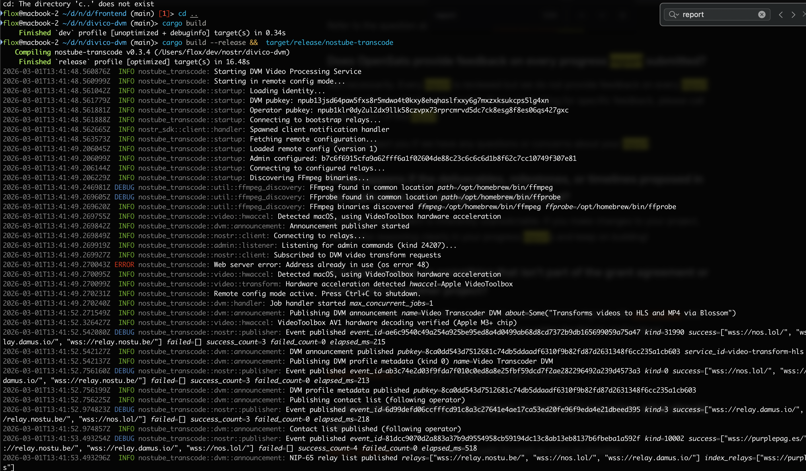
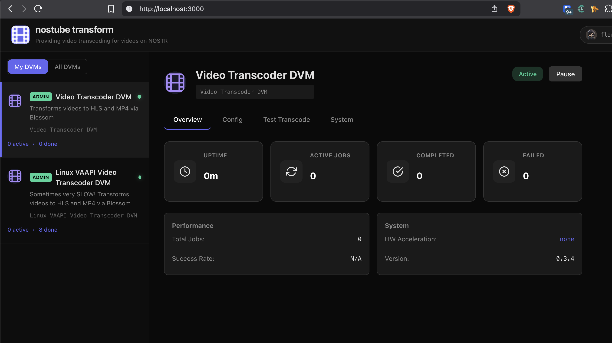
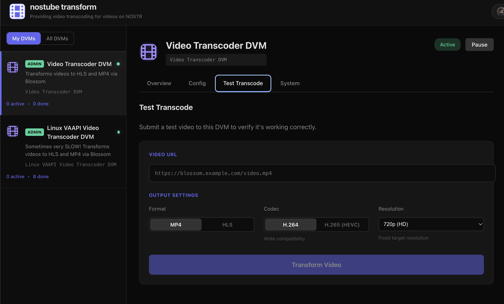
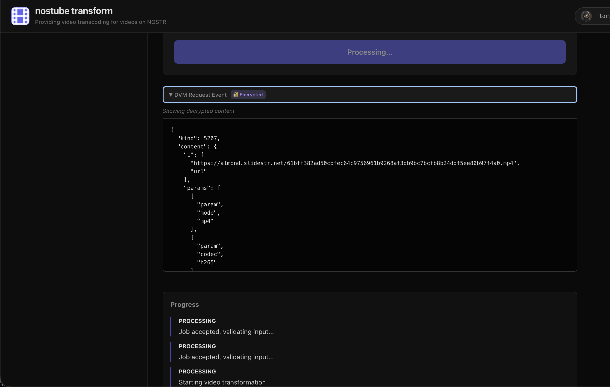
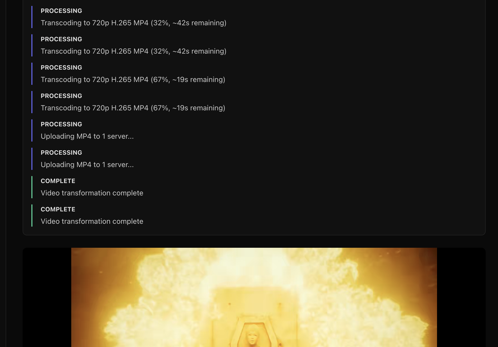

# Screenshots

## Terminal Startup
DVM startup logs showing relay connections, FFmpeg discovery, hardware acceleration detection, and NIP-65 relay publishing.

## Dashboard Overview
Web dashboard showing the DVM list, uptime, job stats, performance metrics, and system info.

## Test Transcode
Test transcode panel with video URL input and output settings (format, codec, resolution).

## Job Processing
Live job view showing the encrypted DVM request event, decoded parameters, and progress updates.

## Job Complete
Completed transcode job with progress timeline and video preview of the result.

